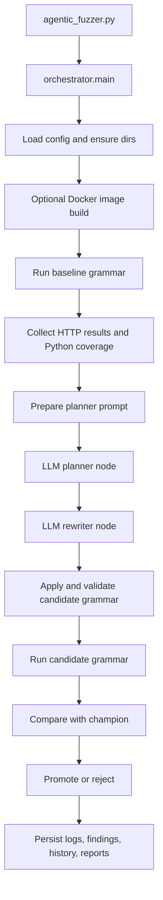

# Agentic Fuzzer Architecture

This document describes the current agentic grammar fuzzer we implemented in `my_fuzzer/`. It is not a generic design note. It explains the system exactly as the code works today: how the run starts, how Docker is controlled, how test cases are generated, how the AI mutates the grammar, how candidate grammars are evaluated, and how reporting and findings are produced.

## 1. Purpose and Design Goals

The fuzzer is a closed-loop, coverage-guided, grammar-based HTTP fuzzer for the local `wttr.in` service.

Its main goal is not just to produce random URLs. It tries to:

- generate syntactically valid request URLs from an ANTLR grammar
- execute those requests against a local Dockerized `wttr.in` instance
- collect Python coverage from the service under test
- summarize execution results and uncovered Python lines
- ask an LLM to reason about what request syntax is still missing
- rewrite only selected grammar rules
- validate the rewritten grammar before execution
- run the candidate grammar and compare it to the current champion
- keep only mutations that preserve or improve coverage
- leave behind enough artifacts to explain every decision

The design is intentionally conservative. We do not let the LLM freely redesign the whole harness. We constrain it to small grammar edits, validate the output, and only promote candidates that survive execution.

## 2. High-Level Architecture

At a high level, the system has seven major layers:

1. CLI and configuration
2. Grammar-based testcase generation
3. Dockerized target lifecycle management
4. HTTP execution and result classification
5. Coverage extraction and prompt preparation
6. LLM planning and grammar rewriting
7. Evaluation, promotion, findings, and reporting

The main entrypoint is `my_fuzzer/agentic_fuzzer.py`, which calls `agent.orchestrator.main()`.



## 3. Code Layout and Component Responsibilities

### 3.1 Entrypoint

`my_fuzzer/agentic_fuzzer.py`

- sets up logging
- calls `agent.orchestrator.main()`
- exits with the orchestrator's return code

### 3.2 Core configuration

`my_fuzzer/agent/core/config.py`

This file defines `FuzzerConfig`, which is the central runtime contract used across the system. It captures:

- repository paths
- grammar and coverage file locations
- helper directories for generated cases, cache, findings, history, logs, reports, and baseline snapshots
- Docker image and port settings
- testcase generation settings
- request, startup, and shutdown timeouts
- LLM settings
- prompt caps for missing files and missing lines per file

Important path conventions:

- grammar under mutation: `my_fuzzer/url.g4`
- testcase output directory: `my_fuzzer/generator/test-cases/`
- coverage JSON export: `my_fuzzer/coverage.json`
- container-mounted cache directory: `my_fuzzer/fuzzer_cache/`
- findings: `my_fuzzer/findings/`
- grammar snapshots: `my_fuzzer/history/`
- iteration logs and batch logs: `my_fuzzer/logs/`
- run report bundles: `my_fuzzer/reports/`
- latest saved baseline snapshot: `my_fuzzer/baselines/`

The `base_url` property is always `http://localhost:<host_port>`.

### 3.3 LLM client

`my_fuzzer/agent/core/llm_client.py`

This layer creates a shared `ChatOpenAI` client and caches it for reuse. The implementation:

- loads `.env`
- requires `LLM_API_KEY`
- uses `LLM_MODEL_NAME` and `LLM_BASE_URL`
- sets `temperature=0.2`
- sets `max_tokens=8192`
- disables built-in retries with `max_retries=0`

There is also a second execution mode in `my_fuzzer/agent/llm.py`:

- if `FUZZER_LLM_COMMAND` is set, the system sends the prompts to an external command instead of the shared LangChain client

This is one of the useful implementation tricks because it lets us swap the model backend without rewriting the orchestration logic.

### 3.4 Testcase generation

`my_fuzzer/agent/utils/grammarinator_utils.py`

This wrapper is responsible for turning `url.g4` into concrete payload files.

The generation flow is:

1. remove the old testcase directory
2. run `grammarinator-process` on `my_fuzzer/url.g4`
3. generate payloads with `grammarinator-generate`
4. return the produced `payload_*.txt` files

The concrete commands are:

```bash
grammarinator-process my_fuzzer/url.g4 -o my_fuzzer/generator --no-actions
grammarinator-generate urlGenerator.urlGenerator -r url -d <depth> -o test-cases/payload_%d.txt -n <cases> --sys-path .
```

This means the grammar is the source of truth for the URL search space. The LLM does not directly generate URLs. It edits the grammar, and Grammarinator samples from the new grammar.

### 3.5 HTTP execution harness

`my_fuzzer/agent/test_runner.py`

This file is the execution harness for one baseline or candidate batch.

It does five important jobs:

1. temporarily writes the grammar under test into `my_fuzzer/url.g4`
2. generates payloads from that grammar
3. expands those payloads into request specs, including headers
4. starts the Docker container and runs HTTP requests
5. stops the container and extracts coverage

The grammar file is always restored in a `finally` block, which prevents a failed candidate run from permanently corrupting the working grammar file.

### 3.6 Docker lifecycle utilities

`my_fuzzer/agent/utils/docker_utils.py`

This layer handles:

- optional image build
- container creation
- port binding
- coverage-file mount
- container stop
- log collection
- container removal

More detail appears in the Docker section below.

### 3.7 Coverage utilities

`my_fuzzer/agent/utils/coverage_utils.py`

This layer:

- loads coverage from the file created inside the container
- combines and exports it with `coverage.py`
- computes summarized coverage stats
- formats result digests
- saves findings
- saves grammar snapshots
- appends JSONL iteration logs
- persists the latest baseline snapshot for later comparisons

### 3.8 LLM orchestration

`my_fuzzer/agent/llm.py`

This file contains:

- prompt assembly for planner and rewriter
- raw LLM invocation
- the two-node LangGraph pipeline

The graph is intentionally simple:

- node 1: `analysis_planner`
- node 2: `grammar_rewriter`

This split is important. One node reasons about coverage and request-space gaps. The second node performs only the mechanical grammar rewrite. That separation is one of the main control tricks in the system.

### 3.9 Grammar validation and mutation control

`my_fuzzer/agent/validator.py`

This file enforces the mutation contract:

- only existing rules may be replaced
- protected rules may not change
- the grammar declaration must remain `grammar url;`
- the replacement block must start with the expected rule name
- the replacement block must contain a terminating `;`
- duplicate updates in one response are rejected
- the resulting grammar must compile through `grammarinator-process`

### 3.10 Request profile expansion

`my_fuzzer/agent/profiles.py`

This file extends the search space beyond URL syntax by generating header profiles for:

- `Host`
- `User-Agent`
- `Accept-Language`
- `X-Forwarded-For`
- `X-Real-IP`

This is a key feature because some Python-covered branches are not reachable by URL grammar changes alone.

### 3.11 Reporting and diff utilities

These files support long-form reporting:

- `my_fuzzer/agent/utils/report_utils.py`
- `my_fuzzer/agent/utils/coverage_diff_utils.py`
- `my_fuzzer/agent/utils/grammar_diff_utils.py`

They generate:

- per-run report directories
- grammar diffs
- coverage diffs
- unavailable reports when a comparison cannot be made
- aggregate coverage across baseline and candidate artifacts over the whole run

## 4. How a Full Run Starts

The run starts in `agent.orchestrator.main()`.

The startup sequence is:

1. parse CLI args
2. build `FuzzerConfig`
3. ensure required directories exist
4. create a Docker client with `docker.from_env()`
5. optionally build the target image if `--build-image` is set
6. read the current grammar as the initial champion
7. initialize run reporting directories and a run slug
8. enter the iteration loop

Important default CLI settings from `parse_args()`:

- `--iterations 10`
- `--cases 1000`
- `--depth 20`
- `--image wttr:latest`
- `--host-port 8002`
- `--container-port 8002`
- `--startup-timeout 20`
- `--request-timeout 10`
- `--stop-timeout 10`
- `--llm-timeout 180`
- `--llm-attempts 3`

The run report slug is created under `my_fuzzer/reports/run_<timestamp>/`, with subdirectories:

- `grammar/`
- `coverage/`
- `summary/`

## 5. How the System Controls Docker

Docker control is deliberately minimal and repeatable.

### 5.1 Image build

If `--build-image` is passed, `build_image()` builds the image from the repository root and tags it with `config.image`.

That build uses:

- Docker build context: repository root
- image tag: typically `wttr:latest`

### 5.2 Container startup

For every baseline or candidate execution batch, `start_container()` creates a fresh container with:

- container name format: `wttr-fuzzer-<pid>-<iteration>`
- `detach=True`
- host-port binding from `127.0.0.1:<host_port>` to `<container_port>/tcp`
- a writable bind mount from `my_fuzzer/fuzzer_cache` to `/app/cache`
- environment variable `COVERAGE_FILE=/app/cache/.coverage`

This coverage mount is the core trick that bridges Docker execution with host-side coverage extraction. The service writes coverage data into the mounted directory, and the orchestrator reads it back from the host filesystem after the container stops.

### 5.3 Readiness check

Before running the generated requests, `wait_for_server()` repeatedly calls:

```text
GET http://localhost:<host_port>/
```

The server is considered ready when it returns a status code below `500`.

This is intentionally forgiving. It does not require a specific success body, only that the service is up enough to process requests.

### 5.4 Shutdown and log capture

After the request batch finishes, `stop_and_collect_container()`:

1. stops the container with a timeout
2. reads the last 400 log lines
3. reloads container state
4. records the exit code
5. force-removes the container

The harness treats exit codes `{0, 130, 143, None}` as normal enough not to automatically count as a container failure. Any other exit code is saved as a finding with the captured logs.

## 6. How Test Cases Are Generated

The system uses grammar-based generation rather than direct LLM-authored request lists.

### 6.1 Grammar under test

The active grammar lives in `my_fuzzer/url.g4`.

The current grammar already includes several important route families and request features, such as:

- regular location queries
- `moon` routes
- `moon@<suffix>` routes
- `?format=` families like `j1`, `j2`, `v2`, `v2n`, `v2d`, `p1`, `png`
- special routes such as `:help`, `:translation`, `:bash.function`, `:iterm2`, `:health`, `:metrics`, `:config`, `:source`
- `.png` path variants
- PNG suffix variants with embedded size and language suffix pieces
- colon-prefixed families like `weather:<CITY>`, `forecast:<CITY>`, `location:<CITY>`
- multi-location weather routes with `:` separators and optional `period=<digits>`
- flag bundles like `A`, `d`, `n`, `m`, `M`, `u`, `I`, `t`, `T`, `p`, `q`, `Q`, `F`, `0`, `1`, `2`, `3`
- special location syntaxes such as percent-encoded names, IPv4-like strings, `~city`, and serialized `b_...` payloads

### 6.2 From grammar to payload files

Each generated payload file contains one full URL.

Examples of the kinds of shapes the grammar can emit are:

- `http://localhost:8002/Cairo`
- `http://localhost:8002/moon`
- `http://localhost:8002/moon@2025-05-01`
- `http://localhost:8002/:help?lang=de`
- `http://localhost:8002/Cairo.png`
- `http://localhost:8002/:weather:Paris:Berlin?period=2`
- `http://localhost:8002/?format=v2&lang=fr`

The number of files is controlled by `case_count`, and the derivation depth is controlled by `generation_depth`.

### 6.3 Why this matters

This architecture gives us a powerful separation of concerns:

- Grammarinator handles broad structured sampling
- the harness handles execution and measurement
- the LLM only edits the structure generator

That is much safer than asking the model to manually produce thousands of ad hoc requests.

## 7. How Requests Are Expanded Beyond the URL

The fuzzer does not treat the URL as the only input. It upgrades every generated payload into a `RequestSpec`, which is:

- a URL
- plus a concrete header dictionary

This matters because many server branches depend on:

- host routing
- browser versus terminal user agent behavior
- language negotiation
- geolocation or proxy headers

### 7.1 Available header profile families

The current implementation defines named profile sets for:

- host values like `wttr.in`, language subdomains, `v2.wttr.in`, `v3.wttr.in`, and `localhost`
- terminal-style and browser-style user agents
- weighted and malformed `Accept-Language` values
- public IP, localhost, private-network, multi-hop proxy, and malformed forwarding chains

### 7.2 How profiles are chosen

If the planner returns explicit `request_space_recommendations`, the harness resolves those recommendations into concrete header sets and builds a bounded cross-product with a maximum of six combinations.

If the planner does not provide recommendations, the system falls back to a small random set of profile combinations.

The generated header sets are then assigned to payloads round-robin.

This is an important implementation trick because it lets the LLM say:

- "the grammar is fine, but use a browser-like user agent"
- "this branch needs `Host: de.wttr.in`"
- "this path is gated by forwarding headers"

without forcing those concepts into the URL grammar itself.

## 8. How the Baseline Batch Executes

For every iteration, the current champion grammar is run first as the baseline.

The baseline batch does the following:

1. remove old `.coverage` and `coverage.json`
2. write the current grammar into `my_fuzzer/url.g4`
3. generate testcase payloads
4. build `RequestSpec` objects
5. start the container
6. wait for server readiness
7. execute HTTP requests with `requests.get()`
8. stop the container and collect logs
9. write results as JSON and Markdown
10. extract Python coverage and export it to JSON

### 8.1 Request result classification

Each request is classified as:

- `SUCCESS` for HTTP `200`
- `WARNING` for non-`200` responses below `500`
- `CRASH` for `500` and above
- `ERROR` for client-side execution failures or empty payloads

The result object records:

- payload filename
- URL
- status
- status code
- error message
- response time in milliseconds
- headers used for the request

### 8.2 Baseline output artifacts

For a baseline batch, the harness writes:

- `my_fuzzer/logs/iteration_<n>_baseline_results.md`
- `my_fuzzer/logs/iteration_<n>_baseline_results.json`
- `my_fuzzer/logs/iteration_<n>_baseline_coverage.json`

It also writes a convenience copy of the Markdown results to:

- `my_fuzzer/generator/test_results.md`

## 9. How Coverage Is Collected and Why It Is Python-Only

Coverage is extracted by `extract_coverage()` in `coverage_utils.py`.

### 9.1 Coverage flow

The target writes `/app/cache/.coverage` inside the container, which is really the mounted host path:

- host: `my_fuzzer/fuzzer_cache/.coverage`
- container: `/app/cache/.coverage`

After the run:

1. the host-side `.coverage` file is copied to `.coverage.docker`
2. `python -m coverage combine` merges it
3. `python -m coverage json` exports JSON to `my_fuzzer/coverage.json`
4. the JSON is parsed and summarized

### 9.2 Why the planner now focuses on Python syntax only

Our measured coverage artifacts contain Python files such as:

- `bin/srv.py`
- `lib/wttr_srv.py`
- `lib/parse_query.py`
- `lib/location.py`
- `lib/view/line.py`
- `lib/view/wttr.py`
- `lib/view/moon.py`
- `lib/fmt/png.py`

That means the prompt-side reachability guide must target only the code that is actually reflected in the coverage signal. Earlier broader codebase references were misleading because they included non-covered implementation surfaces. The current prompt helper explicitly frames the guide as a Python-covered reference only.

### 9.3 Coverage summaries used by the agent

The system does not dump raw giant coverage JSON into the prompt. It compresses the signal into:

- overall coverage percentage
- top missing files
- top missing lines per file
- hotspot summaries
- source excerpts around the uncovered lines
- function names when available from the coverage JSON

This is one of the most useful prompt-engineering tricks in the project because it turns a large coverage file into actionable mutation context.

## 10. How the LLM Mutation Loop Works

The mutation loop is centered in `_mutate_grammar()` inside `orchestrator.py`.

The system uses a two-node LangGraph:

1. `analysis_planner`
2. `grammar_rewriter`

### 10.1 Planner node responsibilities

The planner is responsible for reasoning, not rewriting.

Its prompt contains:

- a description of how `wttr.in` behaves
- the current grammar declaration
- protected-rule context
- the list of editable rules
- the full current grammar
- the Python-only codebase reachability reference
- compact HTTP result summaries
- compact coverage summaries
- missing-line hotspots
- source excerpts around missing lines
- previous validation feedback if the last attempt failed
- recent iteration history
- available request-profile names

The planner returns strict JSON with fields including:

- `analysis`
- `overrepresented_responses`
- `underexplored_url_families`
- `reachable_by_grammar`
- `reachable_by_headers_only`
- `unreachable_harness_limits`
- `line_target_hints`
- `recommended_rule_edits`
- `request_space_recommendations`

The most important part for the current architecture is `line_target_hints`. Each hint is expected to say:

- which line is being targeted
- whether it is reachable by grammar, headers, or harness changes
- what the code signal suggests
- the exact request ingredients needed
- what that implies for grammar mutation

### 10.2 Rewriter node responsibilities

The rewriter does not re-strategize. It only follows the planner output and emits mutation JSON.

Its prompt tells it to:

- follow the planner precisely
- use the line-target hints
- prefer concrete coverage-driving literals and separators
- rewrite only existing editable rules
- keep changes small
- preserve grammar validity
- keep the grammar name unchanged
- never touch protected rules

The rewriter returns JSON matching the mutation contract, with:

- a short `rationale`
- an `updates` array of rule replacements

### 10.3 Why the split planner/rewriter architecture matters

This split gives us several benefits:

- reasoning is separated from code-edit output
- coverage diagnosis can be stored and reported independently
- planner recommendations can include header-space suggestions
- rewriter output stays smaller and easier to validate
- retry feedback can target either reasoning failures or grammar-shape failures

## 11. How the AI Actually Mutates the Grammar

The AI never directly edits files. It proposes a mutation plan, and the harness applies it.

### 11.1 Mutation plan structure

The mutation JSON contains:

- `rationale`
- `updates`

Each update contains:

- `rule`
- `replacement`

The `rule` must already exist in the current grammar. The replacement must be a full valid ANTLR rule block for that rule.

### 11.2 Protected rules

These rules are hard-protected:

- `protocol`
- `host`
- `port`
- `PROTOCOL`
- `HOSTNAME`
- `PORTS`

This is one of the most important safety tricks in the implementation. It locks the base URL to the local harness and prevents the model from changing the protocol, host, or port away from the controlled target.

### 11.3 Allowed mutation scope

The model is allowed to replace only existing editable rules, not add arbitrary new top-level grammar structure.

That keeps mutations narrow and makes diffing, validation, and rollback much easier.

### 11.4 Validation and retries

Each candidate goes through several gates:

1. planner JSON must parse
2. rewriter JSON must parse
3. the mutation plan must apply cleanly
4. protected rules must remain byte-for-byte unchanged
5. the grammar declaration must remain unchanged
6. the resulting grammar must compile through `grammarinator-process`

If a step fails, the system creates targeted feedback and retries up to `llm_attempts`.

Retry feedback distinguishes among:

- graph execution failure
- parse/apply failure
- grammar validation failure

This retry loop is another implementation trick that keeps the system productive even when the model produces imperfect JSON or invalid grammar syntax.

## 12. How Candidate Evaluation Works

Once a candidate grammar passes validation, the system evaluates it in a full execution batch.

The candidate run is almost identical to the baseline run, except:

- it uses the candidate grammar text
- it can use planner-selected request profiles
- its artifacts are written under the `candidate` label

Candidate artifacts include:

- `my_fuzzer/logs/iteration_<n>_candidate_results.md`
- `my_fuzzer/logs/iteration_<n>_candidate_results.json`
- `my_fuzzer/logs/iteration_<n>_candidate_coverage.json`

### 12.1 Champion policy

The orchestrator tracks:

- `best_coverage`
- `best_grammar_text`

Promotion rule:

- if `candidate_percent >= best_coverage`, the candidate becomes the new champion

Regression rule:

- if `candidate_percent < best_coverage`, the candidate is rejected and the best grammar is restored

This means ties are accepted. The system values keeping equivalent coverage with potentially richer reachable structure, instead of demanding strict improvement every time.

### 12.2 Final iteration rule

The final iteration skips mutation entirely.

That is deliberate. There is no reason to spend an LLM call creating a grammar that will never be executed. The last iteration is used as a measurement and reporting endpoint.

## 13. How Findings Are Saved

The system preserves failure evidence aggressively.

Findings are written under `my_fuzzer/findings/iteration_<n>_<label>/`.

Each finding can include:

- `url.g4`
- `payload.txt`
- `metadata.json`

Findings are created for:

- HTTP crashes such as `500` responses
- abnormal container exit codes
- baseline execution errors
- invalid candidate grammar attempts
- candidate execution errors
- candidate regressions

This design makes the fuzzer auditable. We do not just say a mutation failed. We keep the grammar, optional payload, and metadata that explain what happened.

## 14. How Reporting Works

Reporting happens at several levels.

### 14.1 Per-batch execution artifacts

Every baseline and candidate batch writes:

- JSON request results
- Markdown request results
- coverage JSON if coverage extraction succeeded

### 14.2 Iteration JSONL log

`append_iteration_log()` appends a compact JSON object per iteration into:

- `my_fuzzer/logs/iterations.jsonl`

This gives a machine-readable sequence of the whole run.

### 14.3 Grammar snapshots

The system saves grammar history snapshots to `my_fuzzer/history/`, including:

- `iteration_<n>_before.g4`
- `iteration_<n>_after.g4`
- `iteration_<n>_best.g4`

That makes it possible to reconstruct the mutation timeline.

### 14.4 Baseline snapshot persistence

The latest baseline state is saved under `my_fuzzer/baselines/` as:

- `latest_baseline_grammar.g4`
- `latest_baseline_coverage.json`
- `latest_baseline_metadata.json`

This is used as a stable comparison point for later baseline and candidate diff reports.

### 14.5 Per-run report bundle

Each run gets a report directory:

- `my_fuzzer/reports/run_<timestamp>/grammar/`
- `my_fuzzer/reports/run_<timestamp>/coverage/`
- `my_fuzzer/reports/run_<timestamp>/summary/`

The system writes:

- baseline-versus-latest-saved-baseline grammar diffs
- baseline-versus-latest-saved-baseline coverage diffs
- current-versus-candidate grammar diffs
- candidate-versus-latest-saved-baseline coverage diffs
- aggregate coverage across the run
- a summary report

When a comparison cannot be produced, the harness writes an explicit "not available" report instead of silently omitting it.

### 14.6 Run report

At the end of the run, `_write_run_report()` writes:

- a timestamped run report in `my_fuzzer/logs/`
- `my_fuzzer/logs/latest_run_report.md`
- a copy in the run summary directory when available

The run report includes:

- overall status
- timing
- configuration
- champion coverage
- aggregate coverage
- findings count
- iteration summary table
- per-iteration details
- links to batch results, coverage JSON, and diff reports
- counts for planner reachability buckets
- counts for line-target hints
- links to LLM artifacts

### 14.7 Aggregate coverage

At the end of the run, the system unions coverage information across all available baseline and candidate coverage artifacts and writes:

- `cycle_aggregate_coverage.md`

This is useful because the current champion may not reflect every line ever hit during the run. Aggregate reporting tells us what the whole search process reached, not just what the final best grammar retained.

## 15. The Prompt and Reachability Tricks We Implemented

Several of the strongest behaviors in this system come from prompt shaping and signal packaging.

### 15.1 Compact result summaries

Instead of dumping every request, the prompt includes:

- status counts
- response-time summary
- status-code distribution
- crash and error samples
- deduplicated URL diversity samples

This keeps the planner focused on patterns, not noise.

### 15.2 Missing-line source excerpts

For top missing lines, the prompt includes real source excerpts around the uncovered line. That gives the planner concrete evidence such as:

- route literals
- query-key names
- suffix parsing
- flag letters
- header gates

This is what allows the model to recommend exact grammar additions instead of vague "explore more formats" advice.

### 15.3 Python-covered codebase reachability guide

The prompt contains a standing reference guide that maps Python modules to:

- request shapes that reach them
- the grammar ingredients usually required

It currently covers Python-measured surfaces like:

- `lib/wttr_srv.py`
- `lib/parse_query.py`
- `lib/location.py`
- `lib/view/line.py`
- `lib/view/wttr.py`
- `lib/view/moon.py`
- `lib/fmt/png.py`

This guide is intentionally framed around Python coverage only, because that is the signal the harness is optimizing against.

### 15.4 Reachability classification

The planner must distinguish among:

- reachable by grammar
- reachable by headers only
- unreachable due to harness or environment limits

This is important because otherwise the model tends to misuse grammar edits to chase paths that really depend on host headers, language headers, client-type detection, or external environment.

### 15.5 Line-target hints

The planner returns structured hints per actionable line, including:

- target file and line
- delivery class
- code signal
- required inputs
- grammar implication

This is one of the main recent improvements because it converts "line X is uncovered" into "add this exact syntax to reach it."

### 15.6 Iteration-history memory

The planner sees a short recent history of:

- iteration number
- coverage
- mutation decision
- proposed rules
- rationale preview

This reduces repeated unproductive mutations and helps the model avoid retrying the same idea blindly.

## 16. Evaluation Logic in One Iteration

A single non-final iteration behaves like this:

1. read current champion grammar
2. save `before` grammar snapshot
3. run baseline batch
4. record request results and coverage
5. save crash findings and abnormal container-exit findings
6. write baseline comparison reports
7. update champion if the current grammar exceeds the previous best baseline
8. build planner context from results, coverage, history, and feedback
9. run planner node
10. run rewriter node
11. parse and apply the mutation plan
12. validate candidate grammar
13. retry the LLM if validation fails and attempts remain
14. if no valid candidate is produced, record rejection artifacts and keep the champion
15. if a valid candidate exists, run the candidate batch
16. compare candidate coverage to champion coverage
17. promote the candidate if it ties or beats the champion
18. otherwise revert to the best grammar and record a regression finding

## 17. Practical Features and Implementation Tricks

This section summarizes the most important practical decisions we implemented.

### 17.1 We mutate the generator, not the requests directly

The model edits `url.g4`, then Grammarinator samples from it. This preserves structured diversity and makes improvements reusable across many future cases.

### 17.2 We keep the local base URL fixed

Protected rules prevent the model from escaping the intended local target.

### 17.3 We separate reasoning from rewriting

The planner diagnoses the search problem. The rewriter only emits grammar edits. This reduces prompt confusion and improves validation success.

### 17.4 We let the planner control headers as well as grammar

The request-profile system means the model can influence request headers without incorrectly stuffing that logic into URL syntax.

### 17.5 We convert coverage into line-aware mutation hints

Top missing Python lines are shown with nearby source text and turned into structured hint records.

### 17.6 We give the planner a standing codebase reference

The planner does not have to rediscover from scratch how major Python modules are reached.

### 17.7 We retry with feedback

When the model fails, we do not just stop. We tell it whether it failed because of:

- bad JSON
- illegal rule edits
- grammar compilation failure
- graph execution failure

and we let it try again with that concrete feedback.

### 17.8 We keep both baseline and candidate reports

The run is not just "before and after." We preserve:

- baseline versus historical baseline diffs
- current versus candidate diffs
- candidate versus latest-saved-baseline coverage diffs

That gives us multiple ways to understand whether a mutation really helped.

### 17.9 We keep aggregate coverage across the whole cycle

The best final grammar is not always the only interesting artifact. Aggregate coverage shows what the search process discovered overall.

### 17.10 We preserve crash artifacts and regressions

Every important failure path leaves behind enough state to replay and inspect it later.

## 18. Current Limitations and Boundaries

The implementation is strong, but it has clear boundaries.

### 18.1 Coverage optimization is currently Python-centric

The prompt and evaluation logic are tuned to the Python files actually present in the coverage artifacts.

### 18.2 The model can only replace existing rules

This is a safety feature, but it also limits the shape of possible grammar redesigns.

### 18.3 Candidate selection is coverage-first

A candidate is promoted based on measured coverage, not on semantic novelty, bug severity, or crash interestingness.

### 18.4 The harness uses synchronous HTTP execution

Requests are executed sequentially with `requests.get()`. That keeps the system simple and reproducible, but it is not throughput-maximized.

### 18.5 The environment still matters

Some branches may remain effectively unreachable because of:

- missing external dependencies
- data availability
- environment-dependent behavior
- harness constraints

This is why the planner has an explicit `unreachable_harness_limits` bucket.

## 19. Typical End-to-End Story of One Run

In practice, a typical run looks like this:

1. the orchestrator loads the current grammar and starts iteration 1
2. Grammarinator emits a batch of structured URLs
3. the harness adds header profiles and sends the requests to the local Dockerized `wttr.in`
4. request results and Python coverage are captured
5. the planner sees which Python lines are still missing and what kinds of requests dominated the batch
6. the planner recommends exact grammar additions such as route literals, `format=` values, `.png` forms, `moon@...` shapes, flag bundles, or multi-location separators
7. the rewriter emits a small JSON patch over 1 to 3 existing grammar rules
8. the validator applies the patch, protects the local base URL, and compiles the grammar
9. if valid, the candidate grammar is executed with planner-chosen headers
10. if the candidate ties or improves coverage, it becomes the new champion
11. otherwise the previous best grammar is restored
12. logs, diffs, snapshots, findings, and reports are written for later inspection

## 20. Recommended Reading Order in the Code

If someone new wants to understand the implementation quickly, the best reading order is:

1. `my_fuzzer/agentic_fuzzer.py`
2. `my_fuzzer/agent/orchestrator.py`
3. `my_fuzzer/agent/test_runner.py`
4. `my_fuzzer/agent/utils/docker_utils.py`
5. `my_fuzzer/agent/utils/coverage_utils.py`
6. `my_fuzzer/agent/llm.py`
7. `my_fuzzer/agent/validator.py`
8. `my_fuzzer/agent/profiles.py`
9. `my_fuzzer/agent/utils/llm_utils.py`
10. `my_fuzzer/url.g4`

## 21. Summary

The implemented architecture is a disciplined agentic fuzzing loop, not just an LLM glued onto a testcase generator.

The core idea is:

- measure real execution
- compress that signal into actionable planner context
- mutate the grammar in small validated steps
- execute the candidate in the same Dockerized environment
- keep only what survives measurement
- persist enough evidence to understand every promotion, rejection, crash, and coverage change

That combination of grammar control, Docker isolation, Python coverage feedback, planner/rewriter separation, header-space exploration, validation retries, and layered reporting is what makes this fuzzer meaningfully agentic instead of just automated.
